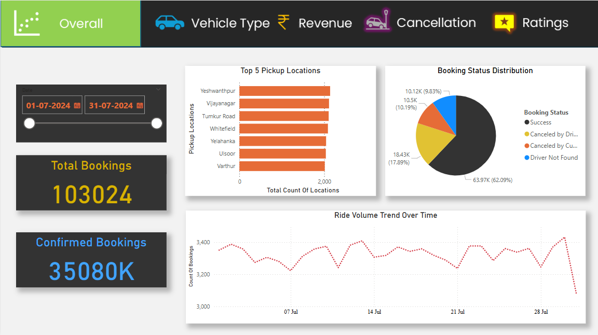
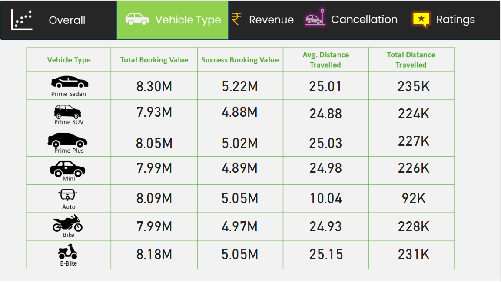
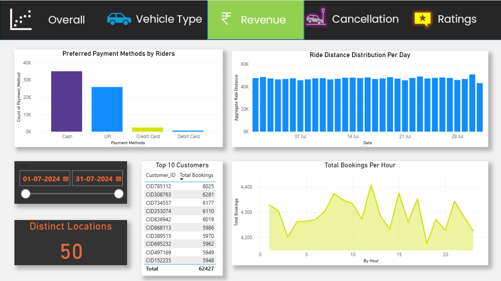
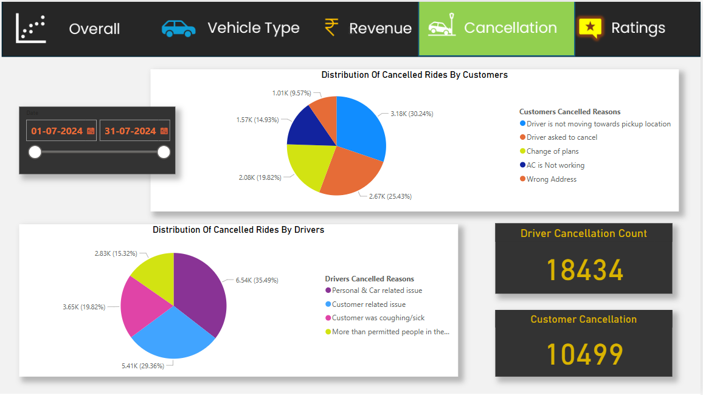
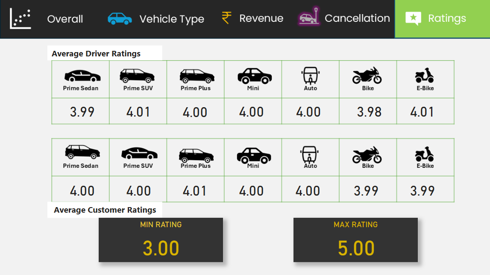

# 🚖 Ola Ride Analysis Dashboard

This Power BI dashboard provides insights into Ola ride booking data across multiple aspects such as booking trends, vehicle types, revenue, cancellations, and user ratings. The purpose of this project is to demonstrate data visualization and storytelling using sample ride data.

## 📁 Project Structure

- `/images`: Contains screenshots of each dashboard page.
- `Ola Analysis Dashboard.pbix`: Power BI file with interactive visuals.

## 📊 Dashboard Pages & Key Questions Answered

### 📌 Page 1: Overall Overview  

****
 **Questions Answered:**
1. What were the total number of bookings ?
2. How many bookings were successfully confirmed?
3. How did ride volume trend over the month? Were there any dips or peaks?
4. Which are the top 5 pickup locations?
5. What percentage of bookings were successful vs canceled?

### 🚗 Page 2: Vehicle Type Analysis  

****  
**Questions Answered:**
1. Which vehicle type generated the highest total booking value?
2. Which vehicle type has the highest success rate compared to total bookings?
3. Which vehicle type contributed to the highest total distance travelled?
4. Which vehicle type has the lowest total distance travelled?

### 💰 Page 3: Revenue Insights  

****  
**Questions Answered:**
1. Which payment method is most preferred by riders?
2. Which customer made the highest number of bookings?
3. How does ride distance vary across different days?
4. What is the total number of bookings by the top 10 customers?
5. At what hour of the day are ride bookings at their peak?

### ❌ Page 4: Cancellation Breakdown  

****  
**Questions Answered:**
1. What is the distribution of cancelled rides by customers?
2. What is the distribution of cancelled rides by drivers?
3. Why do drivers cancel rides most frequently?
4. What percentage of customer cancellations were due to the driver not moving towards the pickup location?
5. How many driver cancellations occurred due to personal and car-related issues?

### ⭐ Page 5: Ratings Analysis  

****  
**Questions Answered:**
1. Which vehicle type has the highest average driver rating?
2. What is the lowest average customer rating among all vehicle types?
3. Which vehicle types received identical average ratings from both drivers and customers?
4. Which star rating is most frequently given by customers?

## 📌 Note  
This project is for learning purposes only and uses sample data to mimic real world scenarios.

